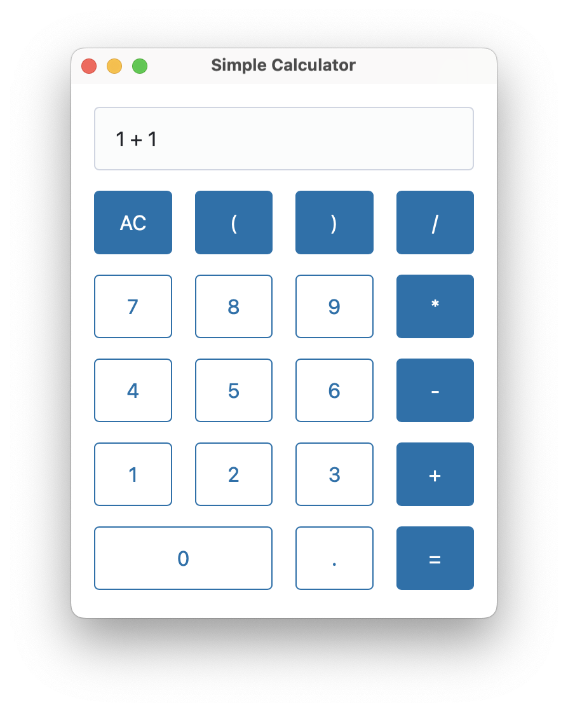

# Simple Calculator

Simple calculator app created by Rust, Dioxus, and Pico Css

<p align="center">
  
</p>


### Serving App

Run the following command in the root of project to start developing with the desktop platform:

```bash
dx serve
```

To run for a different platform, use the `--platform platform` flag. E.g.
```bash
dx serve --platform desktop
```

### Building App

Run the following command in the root of project to build an app with the desktop platform:

```bash
dx bundle
```
